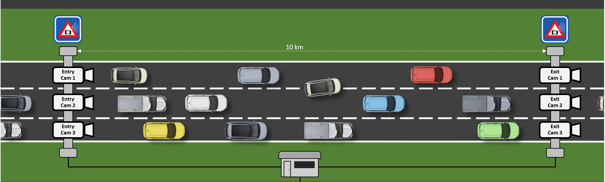
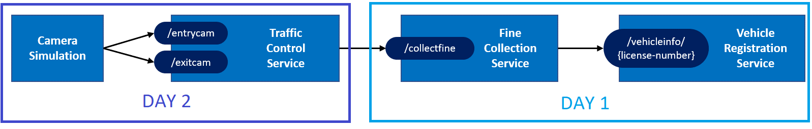
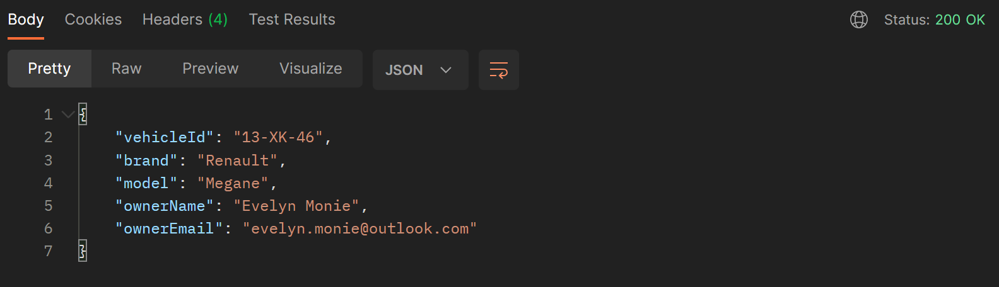

# Day 1 - Dapr Traffic Control Sample

During the 2 days labs you will create a sample application that simulates a traffic-control system using Dapr.
This repository contains the Day 1 services you will impement for the traffic-control system. The traffic-control system is made up of a set of cameras placed at the beginning and the end of a stretch of highway. Using data from these cameras, the average speed of a vehicle is measured. If this average speed is above the speeding limit on this highway, the driver of the vehicle receives a fine.

## Overview

This is an overview of the fictitious setup I'm simulating in this sample:



There's 1 entry-camera and 1 exit-camera per lane. When a car passes an entry-camera, the license-number of the car and the timestamp is registered.

When the car passes an exit-camera, this timestamp is also registered by the system. The system then calculates the average speed of the car based on the entry- and exit-timestamp. If a speeding violation is detected, a message is sent to the FineControlService, that retrieves the information of the owner of the vehicle from the VehicleRegistrationService and send him/her a fine.

## Simulation

In order to simulate this in code, you will create the following services:



- The **Camera Simulation** is a .NET Core console application that will simulate passing cars.
- The **Traffic Control Service** is an ASP.NET Core WebAPI application that offers 2 endpoints: `/entrycam` and `/exitcam`.
- The **Fine Collection Service** is an ASP.NET Core WebAPI application that offers 1 endpoint: `/collectfine` for collecting fines.
- The **Vehicle Registration Service** is an ASP.NET Core WebAPI application that offers 1 endpoint: `/vehicleinfo/{license-number}` for getting the vehicle- and owner-information of speeding vehicle.

The way the simulation works is depicted in the sequence diagram below:


1. The Camera Simulation generates a random license-number and sends a *VehicleRegistered* message (containing this license-number, a random entry-lane (1-3) and the timestamp) to the `/entrycam` endpoint of the TrafficControlService.
1. The TrafficControlService stores the VehicleState (license-number and entry-timestamp).
1. After some random interval, the Camera Simulation sends a *VehicleRegistered* message to the `/exitcam` endpoint of the TrafficControlService (containing the license-number generated in step 1, a random exit-lane (1-3) and the exit timestamp).
1. The TrafficControlService retrieves the VehicleState that was stored at vehicle entry.
1. The TrafficControlService calculates the average speed of the vehicle using the entry- and exit-timestamp. It also stores the VehicleState with the exit timestamp for audit purposes, but this is left out of the sequence diagram for clarity.
1. If the average speed is above the speed-limit, the TrafficControlService calls the `/collectfine` endpoint of the FineCollectionService. The request payload will be a *SpeedingViolation* containing the license-number of the vehicle, the identifier of the road, the speeding-violation in KMh and the timestamp of the violation.
1. The FineCollectionService calculates the fine for the speeding-violation.
1. The FineCollectionSerivice calls the `/vehicleinfo/{license-number}` endpoint of the VehicleRegistrationService with the license-number of the speeding vehicle to retrieve its vehicle- and owner-information.
1. The FineCollectionService sends a fine to the owner of the vehicle by email.

All actions described in this sequence are logged to the console during execution so you can follow the flow.

## Dapr

This sample uses Dapr for implementing several aspects of the application. In the diagram below you see a schematic overview of the setup:


1. For doing request/response type communication between the FineCollectionService and the VehicleRegistrationService, the **service invocation** building block is used.
1. For sending speeding violations to the FineCollectionService, the **publish and subscribe** building block is used. RabbitMQ is used as message broker.
1. For storing the state of a vehicle, the **state management** building block is used. Redis is used as state store.
1. Fines are sent to the owner of a speeding vehicle by email. For sending the email, the Dapr SMTP **output binding** is used.
1. The Dapr **input binding** for MQTT is used to send simulated car info to the TrafficControlService. Mosquitto is used as MQTT broker.
1. The FineCollectionService needs credentials for connecting to the smtp server and a license-key for a fine calculator component. It uses the **secrets management** building block with the local file component to get the credentials and the license-key.
1. The TrafficControlService has an alternative implementation based on Dapr **actors**. See [Run the application with actors](#run-the-application-with-dapr-actors) for instructions on how to run this.

Here is the sequence diagram again, but now with all the Dapr building blocks and components:


## Run the application in Dapr self-hosted mode

In self-hosted mode everything will run on your local machine. To prevent port-collisions, all services listen on a different HTTP port. When running the services with Dapr, you need additional ports voor HTTP and gRPC communication with the sidecars. By default these ports are `3500` and `50001`. But to prevent confusion, you'll use totally different port numbers in the assignments. The services will use the following ports:

| Service                    | Application Port | Dapr sidecar HTTP port | Dapr sidecar gRPC port |
| -------------------------- | ---------------- | ---------------------- | ---------------------- |
| TrafficControlService      | 6000             | 3600                   | 60000                  |
| FineCollectionService      | 6001             | 3601                   | 60001                  |
| VehicleRegistrationService | 6002             | 3602                   | 60002                  |

The ports can be specified on the command-line when starting a service with the Dapr CLI. The following command-line flags can be used:

- `--app-port`
- `--dapr-http-port`
- `--dapr-grpc-port`

Execute the following steps to run the sample application in self hosted mode:

Start infrastructure components:

1. Make sure you have installed Dapr on your machine in self-hosted mode as described in the [Dapr documentation](https://docs.dapr.io/getting-started/install-dapr/).
1. Open a new command-shell.
1. Change the current folder to the `src/infrastructure` folder of this repo.
1. Start the infrastructure services by executing `start-all.ps1` script. This script will start Mosquitto (MQTT broker), RabbitMQ (pub/sub broker) and Maildev. Maildev is a development SMTP server that does not actually send out emails (by default). Instead, it offers a web frontend that will act as an email in-box showing the emails that were sent to the SMTP server. This is very convenient for demos of testscenarios.

Start the services you created:

1. Open a new command-shell.

1. Change the current folder to the `src/VehicleRegistrationService` folder of this repo.

1. Execute the following command (using the Dapr cli) to run the VehicleRegistrationService:

    ```console
    dapr run --app-id vehicleregistrationservice --app-port 6002 --dapr-http-port 3602 --dapr-grpc-port 60002 --components-path ../dapr/components dotnet run
    ```

    >  Alternatively you can also run the `start-selfhosted.ps1` script.

1. Open a new command-shell.

1. Change the current folder to the `src/FineCollectionService` folder of this repo.

1. Execute the following command (using the Dapr cli) to run the FineCollectionService:

    ```console
    dapr run --app-id finecollectionservice --app-port 6001 --dapr-http-port 3601 --dapr-grpc-port 60001 --components-path ../dapr/components dotnet run
    ```

    > Alternatively you can also run the `start-selfhosted.ps1` script.

You should now see logging in each of the shells, similar to the logging shown below:

**FineCollectionService:**  


**VehicleRegistrationService:**  


## Test the services

1. Open Postman.

1. Test the `VehicleRegistrationService` with a GET request to `http://localhost:6002/vehicleinfo/13-XK-46`.

    > Alternatively you can also make the http call with the tool of your choice.

1. You should get this result:

    

1. Test the `FineCollectionService` with a POST request to `http://localhost:6001/collectfine`.

1. Fill the request body with raw JSON as follow:

    ```console
    {
       "VehicleId": "13-XK-46",
       "RoadId": "A14",
       "ViolationInKmh": 20,
       "Timestamp": "2022-07-14T16:53:00"
    }
    ```
    > Alternatively you can also make the http call with the tool of your choice.

1. You should get a 200 OK result and check if there is a new email with the fine details.

1. To see the emails that are sent by the FineCollectionService, open a browser and browse to [http://localhost:4000](http://localhost:4000). You should see the emails coming in:

   